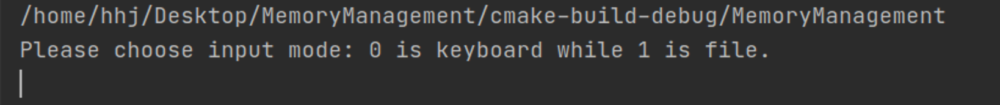
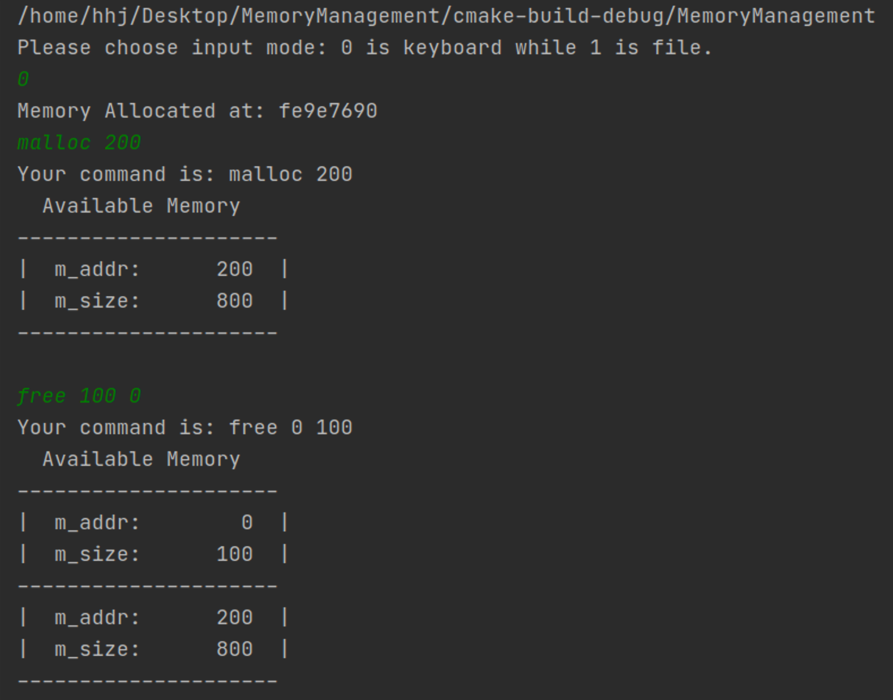
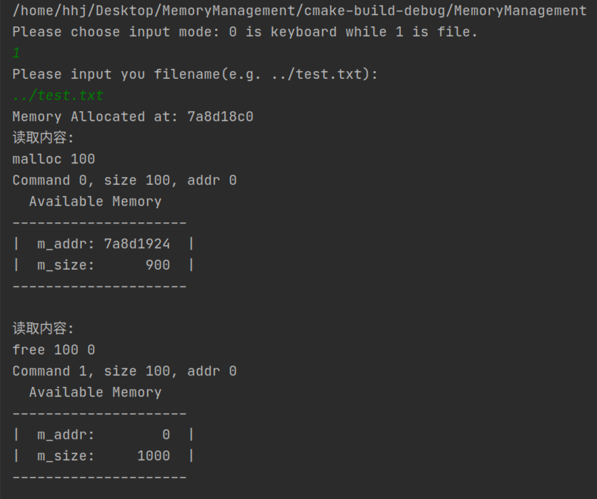

# 实验报告

## 实验名称

实验一 可变分区存储管理


## 实验目标

1. 加深对可变分区存储管理的理解。
2. 考察使用C语言编写代码的能力，特别是C语言编程的难点之一:指针的使用。
3. 复习使用指针实现链表以及在链表上的基本操作。


## 实验原理

把空闲表设计成**顺序结构或链接结构的循环队列**（实际使用了**双向循环链表**），各空闲分区仍按照**地址从低到高**的次序登记在空闲区的管理队列中，同时需要设置一个**起始查找指针**，只想循环队列中的一个空闲区表项。

循环首次适应法分配时总是从起始查找指针所指的表项开始查找，**第一次**找到满足要求的空闲区时，就分配所需的大小的空闲区，修改表项，并调整起始查找指针，使其指向队列中被分配的后面的那块空闲区。下次分配时就从新指向的那块空闲区开始查找。

### 优点

明显提高了分配查找的速度


## 算法与数据结构

算法：

- 用户输入

  - 有**两种模式**，对应两个`handle_input`、`handle_file_input`函数，分别用于处理终端输入和文件输入情况
  - 在`main`函数中定义了用户入口，用户可以自由选择其中的任意一种模式

- 运算处理

  - 将所有功能**封装**在了类`MemoryManagement`中，采用**面向对象**的编程方法，将内存的分配释放的操作封装起来，并拥有**出错处理**
  - 实现与用户输入交互分离，便于开发调试
  - 输出部分定义在类的输出函数中，并且定义了debug模式，输出相对地址，便于测试和观察

- **打印输出**

  - 用如下结构打印出内存的分配状态，一目了然且美观

  - ```
      Available Memory  
    ---------------------
    |  m_addr:     xxxx  |
    |  m_size:     xxxx  |
    ---------------------
    |  m_addr:     xxxx  |
    |  m_size:     xxxx  |
    ---------------------
    |        ...         |
    ---------------------
    |  m_addr:     xxxx  |
    |  m_size:     xxxx  |
    ---------------------
    ```

  - 每个空闲内存块用`---`分离

**数据结构：**

- `struct map`

  - 空闲表项

  - ```cpp
    struct map{
        unsigned m_size;  // 空闲分区的起始大小
        char *m_addr;  // 空闲分区的起始地址
        map *next, *prior;  // 按地址排序后的后继节点和前驱节点
    
        explicit map(char *addr, unsigned int size);  // 构造函数
        explicit map(char *addr, unsigned int size, map *p, map *n);  // 构造函数
        ~map()= default;  // 默认析构函数
    };
    ```

  - **循环双向链表**中的一个表项

- `MemoryManagement`

  - 可变分区存储管理类

  - 向操作系统一次性申请一块连续的内存分区

  - ```cpp
    class MemoryManagement {
    private:
        map *current;  // 循环双向链表
        char *start;  // 连续内存块
        static unsigned int ssize;  // 类静态变量，指定总内存大小
    
        void check(bool, map* = nullptr);  // 工具函数，确保双向链表规则正确
    
    public:
        MemoryManagement();  // 构造函数
        bool lmalloc(unsigned);  // 内存分配，返回成功与否
        void lfree(unsigned int addr, unsigned int size, bool show);   // 内存释放
        void show(bool debug = false) const;  // 输出函数
        void clear();  // 清空
        ~MemoryManagement();  // 析构函数
    };
    ```

  - 通过定义**类静态变量**`ssize`，实现所有变量的内存大小的一键管理

  - 通过分析，仅定义**两个私有变量**即可实现功能

    - 一般双向链表会有头指针和尾指针，而我仅用一个`current`指针代替，并将双向链表构造为循环双向链表，节省内存空间，尽管会增加一些特殊情况需要考虑

  - 工具函数check

    - 用于对分配和释放内存后的链表进行规则**检查**，确保链表中不存在链表项大小为0的项，或者与前后内存连续的项
    - 针对分配和回收情况进行优化，分配时可能需要去除的大小为0的分区就是`current`指针指向的表项，回收时一定是新建的空闲表项有可能与前后表项合并，因此需要传入新建位置的指针
    - 若为内存分配模式，检查分配完的内存块是否大小为0，若是，则删除改表项，将前后链接起来，并考虑分配后没有空闲和只有一个空闲区的情况
    - 若为内存释放模式，将释放的空闲区插入链表中，并检查是否合理，例如是否重复释放或越界等，若是拒绝释放并报错，否则检查是否能够与前后合并，分为先尝试与前合并后尝试与后合并，并考虑释放后只有一个空闲区的情况

  - 构造函数

    - 向系统请求一块连续的内存进行管理
    - 请求失败时输出结果并拒绝提供内存管理服务

  - 析构函数

    - 返还请求的内存

  - 定义两种操作`lmalloc`、`lfreee`，也是用户的使用接口

    - `lmalloc`：
      - 从`current`指针开始分配，大小不够就继续查询后续节点
      - 分配成功调用`check()`，分配失败返回`false`
    - `lfree`：
      - 先遍历找到地址最小的空闲块
      - 检查插入地址是否小于所有空闲区的最小起始地址，或者大于最大起始地址加上空闲大小，若是插入首尾位置
      - 否则，从头依据地址大小关系遍历找到插入位置
      - 插入前先检查释放**内存块是否越界**，是否与其他空闲块重叠，检验通过则插入

  - 定义输出函数`show`，并定义`debug`模式，输出相对位置

  - `clear`清空并初始化


## 出错处理

- 如果`MemoryManagement`向请求连续的空间失败时，会输出错误信息，并将内部指针设置为`nullptr`，拒绝后续操作
- 如果`lmalloc`找不到足够大的空闲内存，将返回`false`，外部程序根据返回值输出操作成功或失败
- 如果`lfree`释放了本来在空闲分区表中管理的空闲内存，会输出报错`Double free space [%x:%x].\n`，如果释放了超过管理内存的地址，就输出报错`Exceed allowed space [%x:%x].\n`。
- 输入错误，分为
  - 用户命令错误
  - 用户命令参数缺失
  - 用户命令参数格式错误
  - 文件路径错误
  - 文件命令错误，错误定位到行`"Command error at line %d.\nExpected parameter:[size].\n`


## 测试方法

对于终端命令输入：

```bash
0
malloc 100
malloc 500
free 100 300
free 50 400
free 50 550
malloc 200
malloc 100
free 100 0
malloc 150
free 100 500
free 150 600
free 1 999
```

对于文件命令输入：

```bash
1
../test.txt
```

以上实验结果包含了分配后归零、释放后合并、内存分配失败、内存多次释放的各种情况，程序在该测试下**运行良好**。


## 实验结果

首先，运行程序会出现如下界面，用户可以选择输入模式[0-键盘，1-文件]。



输入0或1，进入对应模式后，对于：

- 键盘
  - 用户逐行输入命令，实时反馈内存分配情况
  - 输入命令，显示命令执行结果
  - 
- 文件
  - 程序一次性完成所有命令后退出
  - 对于命令错误的行指明行号并忽略
  - 


## 错误分析

经过**大量的测试**，程序在处理内存分配以及合并的过程中能够有效地处理一样情况，不会造成程序的崩溃或者代码运行结果的错误。

大部分可能预知的错误处理已经写在程序的出错处理中，但还有少数可能未考虑。例如对于用户输入，没有对特别奇怪的用户输入进行限制，如果用户输入**大量随意的字符串**，可能造成程序的崩溃，因此，有必要将用户输入处理的借口封装成API调用，增强代码的鲁棒性。


## 实验总结

本次实验中我亲自动手实践了**内存分区管理**技术，使用的方法是**循环首次适应法**，实现了对一块内存区域的分配和释放管理。在实验过程中，我努力优化数据结构和算法，让代码能够尽可能**高效快速**的运行，例如使用循环双向链表结构，用**单指针**遍历修改整个空闲分区表。但指针一直是C语言的一个难点之一，因此对于指针的操作需要非常谨慎，考虑到各种可能的情况，比如为`nullptr`、仅有一个节点和有两个节点的情况，比如插入在连续内存块头部和尾部的情况，比如新增节点后的指针变动等。这些不但提升了我的代码编程能力，尤其是对于C语言的理解，而且锻炼了我的思考能力和对问题全面分析的能力，仔细地审查自己的代码逻辑是否具有漏洞，是否考虑到了各种情况，这对于身为**网络安全专业的我**来说也是非常重要的。

对于本次实验我本来想设计一个**有限自动状态机**来处理用户的输入，但是由于对C的掌握能力还不够，设计出来的`FSM`非常复杂不优雅，于是我舍弃了这一方案。但是，我依然希望自己能够通过不断地学习实现这一效果，督促自己不断学习新的知识，**提升自己的能力**。

最后，本次实验对我理解内存分区管理的各种技术有**巨大的帮助**，只有在亲自动手实践的情况下我才能发现自己对哪些概念的理解有问题，哪些还不够深刻，这对于我课内知识的学习也有很大的帮助。感谢老师在**课堂**讲授的知识帮助我顺利完成了本次实验。


---

作者：黄弘骏

作业github地址：https://github.com/Harry-hhj/IS206-MemoryManagement.git

报告日期：2020-04-18

